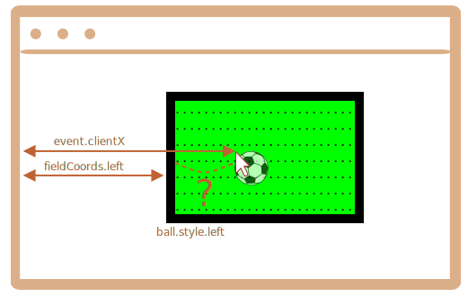

Pertama kita perlu memilih metode untuk memposisikan bola.

Kita tidak dapat menggunakan `position:fixed` untuk itu, karena pada saat halaman digulir bola akan berpindah dari lapangan.

Jadi kita sebaiknya menggunakan `position:absolute` dan, untuk membuat posisinya benar-benar tepat, buat lapangan(_`field`_) itu sendiri diposisikan.

Kemudian bola akan diposisikan relatif terhadap lapangan(_`field`_):

```css
#field {
  width: 200px;
  height: 150px;
  position: relative;
}

#ball {
  position: absolute;
  left: 0; /* relatif ke posisi terdekat blok atas (lapangan) */
  top: 0;
  transition: 1s all; /* Animasi CSS untuk left/top untuk membuat bolanya terbang */
}
```

Selanjutnya kita harus mengatur dengan benar `ball.style.left/top`. Mereka memiliki koordinat relatif ke lapangan(_`field`_) sekarang.

Berikut ini gambarnya:



Kita memiliki `event.clientX/clientY` -- koordinat relatif jendela (_window_) dari klik.

Untuk mendapatkan koordinat kiri relatif terhadap lapangan(_`field`_), kita kurangkan dengan nilai dari ujung dan pembatas kiri lapangan:

```js
let left = event.clientX - fieldCoords.left - field.clientLeft;
```

Biasanya, `ball.style.left` artinya "ujung kiri dari elemen" (bola). Jadi kita mengatur nilai `left`, kemudian ujung bola, bukan tengah, akan berada tepat dibawah kursor mouse.

Kita perlu memindahkan bola setengah lebar kiri dan setengah tinggi atas untuk membuatnya di tengah.

Jadi nilai terakhir `left` akan menjadi:

```js
let left = event.clientX - fieldCoords.left - field.clientLeft - ball.offsetWidth/2;
```

Koordinat vertikal di ukur dengan menggunakan logika yang sama.

Harap dicatat bahwa lebar/tinggi bola harus di ketahui pada saat kita mengakses `ball.offsetWidth`. Sebaiknya di atur pada HTML atau CSS.
